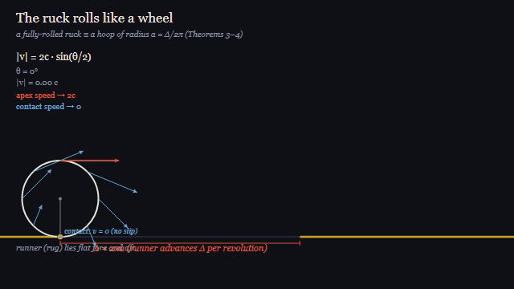

# The Physics of a Runner Rippling over Carpet — *The Ruck in a Rug*

A mathematically rigorous, self-contained tutorial on the **ruck** — the travelling wrinkle that forms when you walk on a rug or push a wheelchair across it. It derives, from first principles, the ruck's *shape*, its *size*, and how it *rolls across the carpet* — and why propagating a ruck is how you move a heavy rug without dragging it.

### ▶ Read it live (interactive math + animations)

**https://az9713.github.io/ruck-in-a-rug/** — rendered with MathJax; best viewed in a browser (the static file below is the same content).

📄 Source: [`ruck-in-a-rug.html`](ruck-in-a-rug.html) — one self-contained file (HTML + MathJax + inline SVG/SMIL, no build step).

> Note: GitHub READMEs render math unreliably, so the equations below are written in plain Unicode. The tutorial itself renders them properly via MathJax — see the live link.

---

## The ruck rolls like a wheel



*A fully-rolled ruck is kinematically a **hoop of radius a = Δ/2π** rolling without slip. The bright dot is one material point of the rug; it traces a **cycloid**. Its lab-frame speed is |v| = 2c·sin(θ/2) — **zero at the contact point** (no slip) and **2c at the crest**. The cusp-to-cusp spacing is the excess length Δ: one revolution advances the rug by exactly Δ. This single kinematic fact gives the dynamics — the ruck accelerates downhill like a hoop, a = ½ g·sinα.*

🎬 Full-quality video (1280×720, 12 s): [`remotion/out/ruck-cycloid.mp4`](remotion/out/ruck-cycloid.mp4) · built with [Remotion](https://remotion.dev) (source in [`remotion/`](remotion/)).

---

## What's inside the tutorial

A single narrative spine, each section building on the last:

0. **How a ruck is born** — walking (a frictional ratchet that pumps in excess length) and a rolling load (a driven, phase-locked ruck). Includes a **SMIL animation** of the push-off/recovery ratchet.
1. **Setup & the bending law** — the elastica and the constitutive law M = Bκ, derived from fibre stress.
2. **The equilibrium shape** — the heavy-elastica equation by energy minimization.
3. **The natural length scale** — the elasto-gravity length ℓ_eg = (B/w)^(1/3), *the ruck's own size*, with cantilever-droop and energy-balance derivations.
4. **The shape of a shallow ruck** — exact small-slope (buckled-cosine) profile; nucleation onset.
5. **Height & length** — selection by energy minimization (λ⋆, h⋆ ∼ ℓ_eg, with 1/7 and 4/7 exponents).
6–9. **Motion** — rolls like a wheel → effective mass M_eff = 2mΔ → acceleration a = ½ g·sinα → load-driven phase-locking c = U.
10. **Why moving the ruck moves the whole carpet** — net shift Δ per pass; rucking ≪ dragging.
11–12. Worked numbers and a results table. **Appendix:** the exact nonlinear (elliptic-integral) treatment.

Every theorem carries a setup SVG mapping its symbols onto geometry; every section reference is a working link.

## Development journey

This grew through iterative co-development with Claude Code — a good illustration of how a dense technical artifact gets built and *hardened*:

1. **First draft** — generated the rigorous tutorial as one self-contained HTML file (MathJax for math, inline SVG for figures).
2. **Symbol diagrams** — added labelled geometry figures so every symbol (s, θ, κ, h, λ, …) maps to a picture; fixed a tangent line that wasn't actually tangent (computed the real Bézier derivative).
3. **Animation** — built the Remotion rolling-cycloid video tying the kinematics to a rolling wheel.
4. **Motivation** — added Section 0 (walking & wheelchair) so the reader sees *where a ruck comes from* before the analysis, and cashed out both scenarios (nucleation onset; the c = U phase-locking) in the body.
5. **Rigor passes** — caught and fixed two instructive bugs: a `$…$$` **delimiter mismatch** that scrambled a proof, and a literal `<` inside math that the **HTML parser turned into phantom `<s>` tags** (the fix: `\lt`/`\gt`). Added a setup SVG to *every* proof.
6. **Readability** — linked all 60+ section cross-references; ensured every symbol and technical term is **defined before first use**, self-contained rather than forward-referenced.
7. **Restructure** — reorganized into the single building spine above; relocated ℓ_eg to where it's earned and re-motivated it; demoted the exact-nonlinear track to an Appendix; trimmed the dislocation analogy to its physical result.
8. **More pictures** — geometry SVGs for ℓ_eg and the cantilever droop; fixed a sloppy ∫sin² written without its argument.
9. **Animated the ratchet** — a looping SMIL animation of the walking push-off/recovery cycle, since the asymmetric slip is hard to picture statically.

Throughout, the math was validated by small scripts checking delimiter balance, stray angle brackets, and that every section link resolves.

## Viewing & rebuilding

- **View the tutorial:** open `ruck-in-a-rug.html` in any browser (needs network once, for the MathJax CDN), or use the live link above.
- **Rebuild the animation:**
  ```bash
  cd remotion
  npm install
  npm run render   # → out/ruck-cycloid.mp4
  npm run gif      # → out/ruck-cycloid.gif
  npm run studio   # interactive preview
  ```

## Tech notes

- Tutorial: a single HTML file. Math via MathJax v3 (SVG output). Figures are hand-authored inline SVG; the two animations use SVG **SMIL** (`<animateTransform>`) — no JavaScript, works offline.
- Video: [Remotion](https://remotion.dev) (React + TypeScript), composition in `remotion/src/Cycloid.tsx`.

---

*First version — there is plenty left to do (a first-principles model of the contact-line dissipation, the full subcritical bifurcation, the genuinely 2D ruck). Corrections welcome.*

Built with [Claude Code](https://claude.com/claude-code). Physics after Kolinski, Aussillous & Mahadevan, *Shape and Motion of a Ruck in a Rug*, PRL **103**, 174302 (2009).
